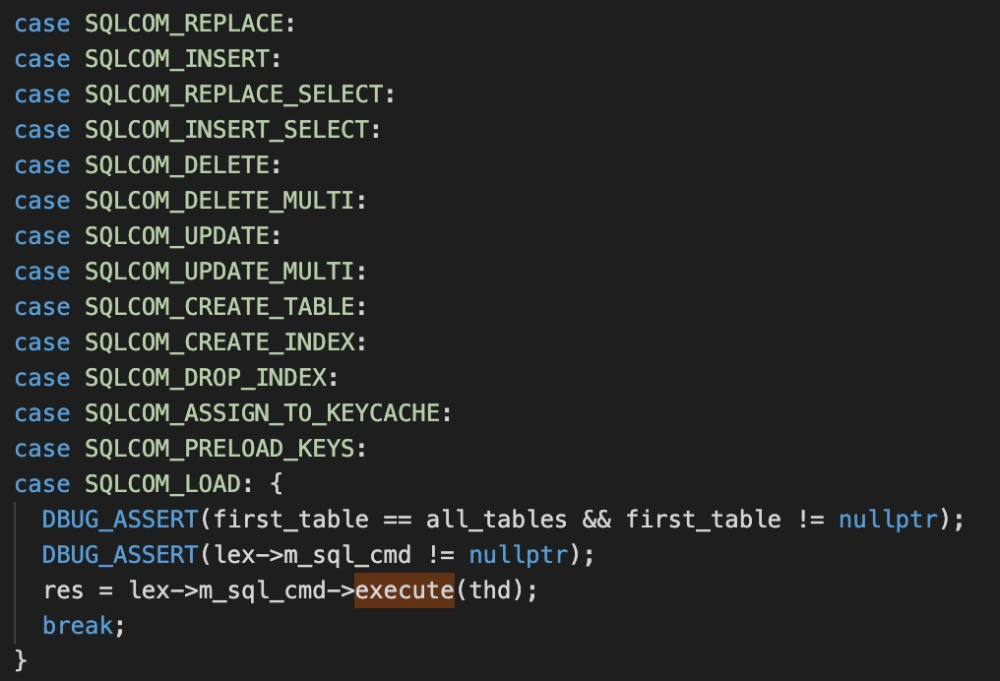

## 前言
上一节，我们大致过了一些mysql存储引擎为CSV类型的table文件是如何存储的。那么这一节，我们来看看一条insert语句是如何执行的，并且落到CSV文件中的。看了很多现在网上的源码分析，都是发现5.X与8.0代码上差距还是挺大的。

## 简单的插入
```sql
mysql> insert into user1 values ( 1,'aaa','bbb');
```

## 代码分析
上一节大致我们提到，mysql是如何监听SQL_COM的,所有的入口都是在do_command
```bash
>Per_thread_connection_handler::add_connection
| >handle_connection
| | >do_command
| | | >dispatch_command
| | | | >mysql_parse
| | | | | >mysql_execute_command
| | | | | | >lex->m_sql_cmd->execute
```
insert语句就是SQLCOM_INSERT


传入的对象是THD，我们所说的数据库的连接就是这个对象，每一个连接就是一个THD对象，里面的内容包含比较多，个人觉得在这里展开去说没有什么意义，没有我们会慢慢的去使用这块。

到了这里，是各种的解析器，以及让让人比较费解的设计模式，可读性不是特别强。因此我们还是像上一节一样从存储落地开始分析。从上一节我们支持，CSV对应的存储引擎的操作都是在ha_tina.cc
```bash
>write_record
| >handler::ha_write_row
| | >ha_tina::write_row
```
到这里就比较明确的，insert对应的值是在这里写入的，但是这里再往上，相对于之前的老版本就有了比较明显的差距了。
先要看看对应的CMD是怎么去构造的。
```bash
>mysql_parse
| >parse_sql
| | >THD::sql_parser
| | | >sql_yacc::MYSQLparse #构建Parse_tree_root对象
| | | >LEX::make_sql_cmd 
| | | | >PT_insert::make_cmd
| | | | | >new (thd->mem_root) Sql_cmd_insert_values 
```
MYSQLparse这段代码看起来相对比较晦涩。大致的逻辑就是，根据解析出来的SQL选择对应的触发器。

## 总结
到这里，差不多已经了解了CSV存储引擎，insert一条数据的最主要的流程。

记住这里只是一个主流程，由于CSV基本上是不能在简单的存储结构，对应的事务、索引等等都没有涉及。到这里差不多MySQL的代码运行结构也了解的一些了，不过还差很多。

